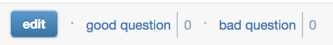
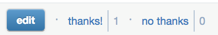

# Badnote




Badnote is a browser extension that enhances piazza by adding the ability to show your disapproval of others' posts. This includes the addition of a "bad note" button on notes, a "bad question" button on questions and a "no thanks" button on responses.

This is a **BETA** (alpha?) feel free to report issues.

## Installation
### Firefox
[Click here](https://elanini.com/update/badnote.xpi) and install.

### Chrome
- [Click here](https://elanini.com/update/badnote.crx)
- [Go to the extensions page](chrome://extensions/)
- Drag downloaded crx file to Chrome window
- Install

## Updating
Extensions are automatically updated.

## Implementation
No Piazza authentication is used. We generate a random number and put it in browser local storage, using it as a user ID. A vote is simply a row in the database with post ID and user ID (and post type - student question, student answer, instructor answer). POST/GET/DELETE for voting and checking the vote. 

Please be nice to the server. Otherwise I'll just turn it off.

We're using ExpressJS as the backend with a simple sqlite database. JQuery and the usual suspects for the extension. 

### Running the server yourself
Requires node 9.x

To run:
```
cd server
npm install
node index.js
```

# Disclaimer
This extension and the people who wrote it are in no way affiliated with Piazza.

Also it's a joke.
